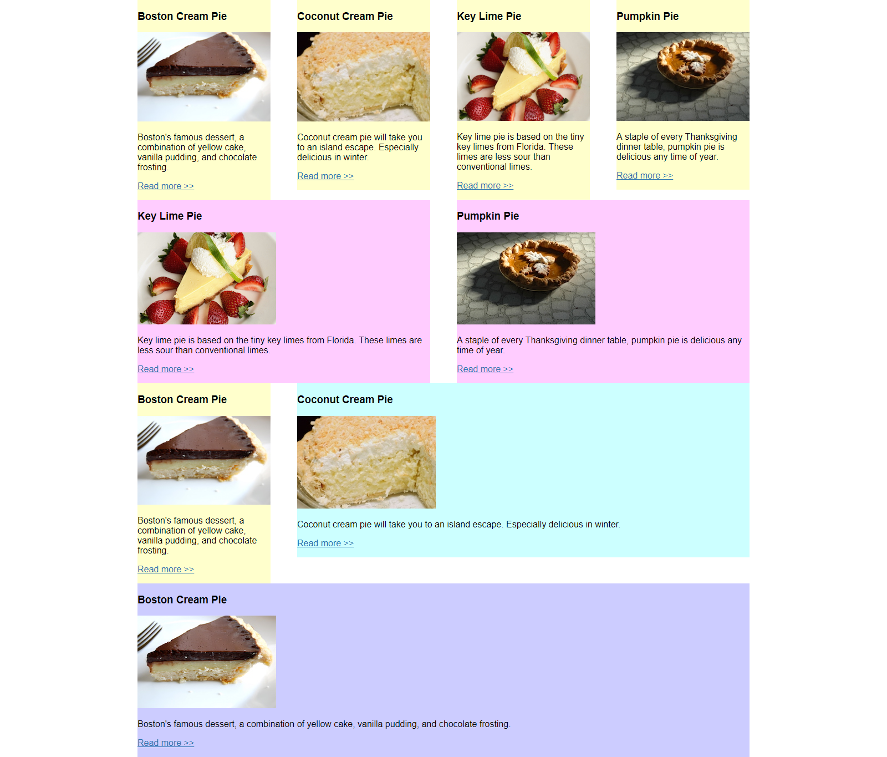
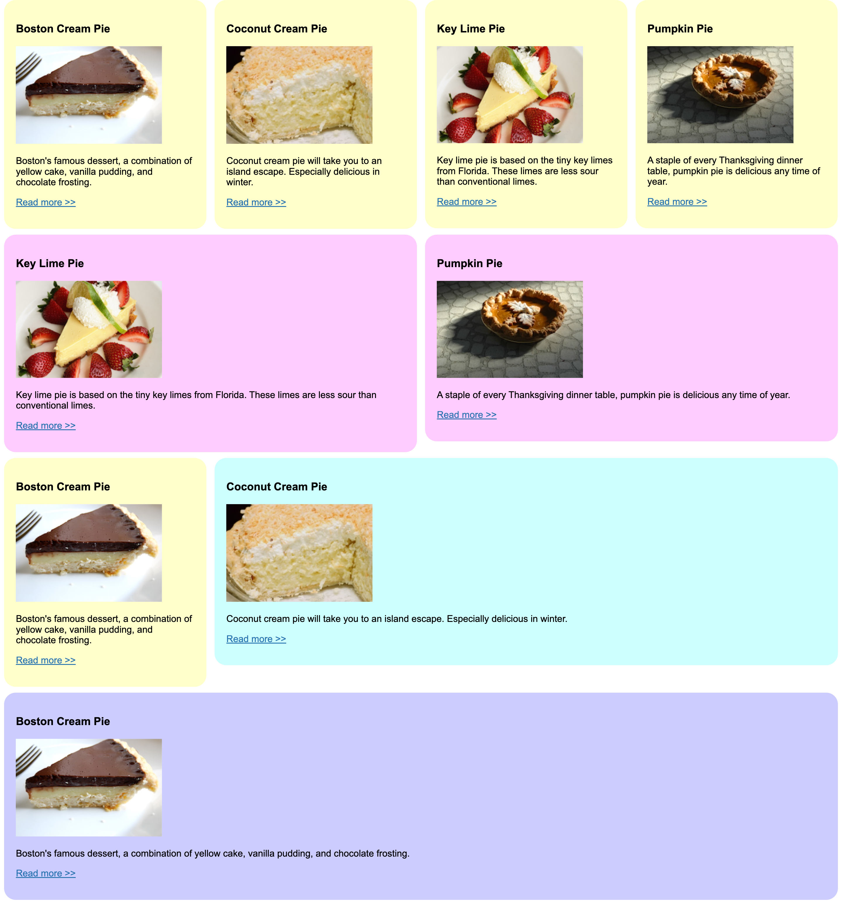

# CSS Float Example

This project features a simple responsive webpage created using CSS Float and media queries, inspired by Jen Kramer’s course on Front End Master. This webpage illustrates the use of the float method in CSS layout, highlighting its strengths and weaknesses compared to Flexbox.

## Features

- Responsive design utilizing media queries
- Demonstration of the CSS Float layout method
- Updated card radius and padding to enhance the design based on Jen Kramer's original example

## Visual Design

Below are visual representations of both Jen Kramer's example and my implementation:

### Jen Kramer's Webpage Example



### My Webpage



## Getting Started

To view the website locally, follow these steps:

1. Clone the repository or download the files.

```
git clone https://github.com/BhoomiGohil/Float-CardsUI.git
cd Float-CardsUI
```

2. Open the `Index.html` file in your web browser.

```
open Index.html
```

OR

Using Live Server in Visual Studio Code:

1. **Install the Live Server extension:**
   Open Visual Studio Code Go to the Extensions view by clicking on the square icon on the left sidebar or pressing Ctrl+Shift+X Search for "Live Server" and click Install

2. Once installed, right-click on index.html and select "Open with Live Server".

This will open the project in your browser, and changes made to the code will be reflected automatically.

## Technologies Used

- HTML5
- CSS3 (Float, Media Queries)

## Acknowledgments

- Special thanks to Jen Kramer for the informative course that inspired this project.
